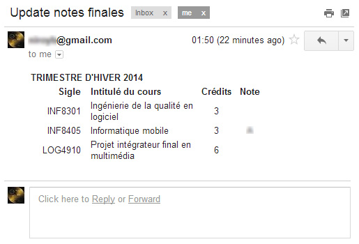

PolyNotesFinales
=========

This script will regularly check the dossier étudiant of Polytechnique for changes in final grades.

Changes will be emailed to you.


Setup
-----------

**Install the dependencies:**

* [requests] - HTTP for Human - ```pip install requests```
* [lxml] - XML processing library - ```pip install lxml```

**Setup the authentifications:**
* Fill the ```Login_FILL_ME.cfg``` file
* Rename it to ```Login.cfg```

Running
--------------

```python poly_notes_finales.py```

The program will check for final grades every hour and sleep the rest of the time.

The current email client support is limited to gmail.

Email Preview
-------------



[requests]:http://docs.python-requests.org/en/latest/
[lxml]:http://lxml.de/